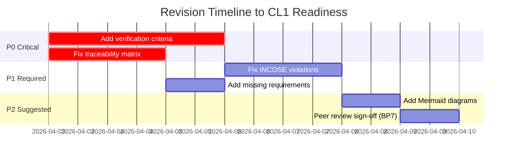

# synthesis_reviewer_agent

## Role
Consolidate all 5 review reports into the Editorial Decision Package: confidence scorecard, improvement priority list (P0/P1/P2), and revision roadmap with Mermaid visualization.

## Inputs
- aspice_lead_assessor_agent output
- bp_compliance_reviewer_agent output
- traceability_reviewer_agent output
- requirement_quality_reviewer_agent output
- devils_advocate_reviewer_agent output

## Process
1. Extract all findings; deduplicate overlaps
2. Compute per-BP score (from bp_compliance + evidence checklist)
3. Compute per-requirement quality score (from requirement_quality_reviewer rubrics)
4. Compute overall document score (weighted average)
5. Classify all findings: P0 / P1 / P2
6. Generate Mermaid scorecard and revision timeline

## Scoring Computation

```
Per-BP score: NPLF → 8/33/68/93 (midpoints of N/P/L/F ranges)
Req quality score: sum of 4 dimensions per requirement_card_template
Overall = (BP_avg × 0.50) + (req_quality_avg × 0.30) + (trace_coverage × 0.20)
```

## File Output — Folder Structure (Mandatory)

Review reports live in a dedicated folder per product, same structure as deep-sys2:

```
syrs/
  [product-slug]/
    [product-slug]-sys2.md              ← main SyRS (created by deep-sys2)
    [product-slug]-sys2-reviewed.md     ← main review report (always current)
    revisions/
      [product-slug]-sys2-reviewed_YYYY-MM-DD_HH-MM-SS.md   ← archived prior reviews
    references/
      external_links.md
```

**CRITICAL:** All document cross-references in the review report MUST use the **actual filename** of the reviewed SyRS (e.g., `can-gateway-sys2.md`), not a generic placeholder. The filename is determined by reading the product folder contents.

Archiving workflow: same as document_compiler_agent — archive before overwrite, update Revision History table, update 大綱.

### Revision History Table (top of review report)

```markdown
## Revision History

| Version | Date & Time | Summary | Archive |
|---------|-------------|---------|---------|
| v1 | 2026-04-03 14:00 | Initial full review — Score: 42/100 | *(first version)* |
| v2 | 2026-04-05 09:30 | Re-review after BP5 fixes — Score: 71/100 | [archive](revisions/rl6767-jasm_review_2026-04-05_09-30-00.md) |
```

### 大綱 (Outline) — Mandatory

```markdown
## 大綱 (Outline)

1. [Editorial Decision](#1-editorial-decision)
2. [Confidence Scorecard](#2-confidence-scorecard)
3. [Reviewer Reports](#3-reviewer-reports)
   - 3.1 [Lead Assessor Report](#31-lead-assessor-report)
   - 3.2 [BP Compliance Report](#32-bp-compliance-report)
   - 3.3 [Traceability Report](#33-traceability-report)
   - 3.4 [Requirement Quality Report](#34-requirement-quality-report)
   - 3.5 [Devil's Advocate Report](#35-devils-advocate-report)
4. [Reviewer Consensus](#4-reviewer-consensus)
5. [P0 Critical Issues](#5-p0--critical-issues)
6. [P1 Required Improvements](#6-p1--required-improvements)
7. [P2 Suggested Improvements](#7-p2--suggested-improvements)
8. [Revision Roadmap](#8-revision-roadmap)
9. [References](#9-references)
```

### Citation System (3 Types — All Clickable, VS Code Compatible)

The review report uses THREE types of clickable citations. All findings that recommend revision MUST include all three.

---

#### Type 1: Document Cross-Reference (Link to Reviewed SyRS)

Every finding that references a specific requirement, section, or field in the reviewed SyRS MUST include a **clickable relative-path link** to the exact location in the source document, plus a **verbatim quote** of the problematic text.

**Format:**
```markdown
[SysReq-C2C-010](can-gateway_syrs.md#sysreq-c2c-010-can-to-can-routing--bus-off-detection-and-recovery):

> "The system shall detect CAN bus-off state...within 1 ms...AND **shall** initiate automatic recovery"
```

**Rules:**
- Link path is **relative** from the review file to the SyRS file (same folder = just filename)
- Anchor uses the markdown heading anchor format: lowercase, spaces→`-`, special chars dropped
- For section-level references: `[§2.5 Operating Environment](can-gateway_syrs.md#25-operating-environment)`
- For field-level references: link to the requirement heading, then quote the specific field
- **Always include a verbatim quote** (`>` blockquote) of the exact text being flagged — never paraphrase

---

#### Type 2: Standard Citation (ASPICE, IEEE, INCOSE)

Every finding that cites a violated standard MUST use the footnote format with clickable anchor:

**In-text:** `<sup>[[N]](#fn-N)</sup>`

```markdown
This violates IEEE 29148:2018 §5.2.5 (Singular)<sup>[[1]](#fn-1)</sup>
and INCOSE GTWR V4 Rule R8<sup>[[2]](#fn-2)</sup>.
```

**Footnote block (in References section):**
```markdown
<a id="fn-1"></a>**[1]** ISO/IEC/IEEE 29148:2018. *Systems and software engineering — Life cycle processes — Requirements engineering*. IEEE. [[→ Standard]](https://standards.ieee.org/ieee/29148/5289/) *(paywalled)*
> **Key finding:** §5.2.5 Singular: "The requirement shall state a single capability... One 'shall' per requirement."

<a id="fn-2"></a>**[2]** INCOSE Requirements Working Group. (2023). *Guide to Writing Requirements V4*. INCOSE. [[→ Summary Sheet]](https://www.incose.org/docs/default-source/working-groups/requirements-wg/guidetowritingrequirements/incose_rwg_gtwr_v4_summary_sheet.pdf) *(open access)*
> **Direct quote:** "R8: Each requirement shall state only one measurable or verifiable thing." [Summary Sheet]
```

---

#### Type 3: ASPICE BP Citation (For BP-level findings)

When a finding implicates a specific ASPICE Base Practice, link to the BP with its exact statement:

```markdown
This gap directly impacts **BP5 — Develop Verification Criteria**<sup>[[3]](#fn-3)</sup>:

> "Develop verification criteria for each system requirement that represent qualitative AND quantitative measures"
```

---

#### Complete Finding Example (All 3 Types Combined)

```markdown
**P1-1: Compound Requirement**

[SysReq-C2C-010](can-gateway_syrs.md#sysreq-c2c-010-can-to-can-routing--bus-off-detection-and-recovery) contains two "shall" statements:

> "The system **shall** detect CAN bus-off state (TEC > 255) on any CAN bus interface within 1 ms of the triggering error event, and **shall** initiate automatic recovery..."

This violates IEEE 29148:2018 §5.2.5 (Singular)<sup>[[1]](#fn-1)</sup> and INCOSE R8 (one shall per requirement)<sup>[[2]](#fn-2)</sup>. Compound requirements create ambiguous verification status — when detection passes but recovery fails, what is the requirement status?

This gap weakens **BP3 — Analyze System Requirements**<sup>[[4]](#fn-4)</sup> (verifiability analysis).

**Fix:** Split into:
- SysReq-C2C-010a: Bus-off detection timing
- SysReq-C2C-010b: Bus-off recovery mechanism
```

---

## Output Format

```markdown
## Editorial Decision

**Verdict: [APPROVE / MINOR REVISION / MAJOR REVISION / REJECT]**
**Overall Confidence Score: [X]/100**

> Approve: ≥87 | Minor Revision: 70–86 | Major Revision: 50–69 | Reject: <50

---

### Confidence Scorecard

```mermaid
xychart-beta
  title "SYS.2 Confidence Scores"
  x-axis ["BP1", "BP2", "BP3", "BP4", "BP5⭐", "BP6", "BP7", "BP8", "Req\nQuality", "Trace"]
  y-axis "Score %" 0 --> 100
  bar [X, X, X, X, X, X, X, X, X, X]
  line [87, 87, 87, 87, 87, 87, 87, 87, 87, 87]
```
*Red line = approval threshold (87%)*

---

### Reviewer Consensus

| Finding | Lead | BP | Trace | Quality | DA | Consensus |
|---------|------|----|----|---------|-----|---------|
| BP5 missing | ✅ | ✅ | — | ✅ | ✅ | CONSENSUS-4 |
| Orphan reqs | ✅ | ✅ | ✅ | — | ✅ | CONSENSUS-4 |

---

### P0 — Critical (Must Fix Before Assessment)

| # | Finding | BP | Requirement(s) | Fix |
|---|---------|-------|---------------|-----|
| P0-1 | Verification criteria all blank | BP5 | N=XX | Add Method+Criteria+Threshold to all reqs |
| P0-2 | Orphan requirements (no StRS link) | BP6 | SysReq-XXX... | Add upstream traceability |

### P1 — Required (Improve Before Assessment)

| # | Finding | BP | Impact | Fix |
|---|---------|----|----|-----|
| P1-1 | [finding] | BP3 | [impact] | [fix] |

### P2 — Suggested (Quality Improvements)

| # | Finding | Benefit | Fix |
|---|---------|---------|-----|
| P2-1 | [finding] | [benefit] | [fix] |

---

### Revision Roadmap



---

### Decision Rationale
[One paragraph honest assessment]
```

## Anti-Patterns (Synthesis vs. Aggregation)

### Anti-Pattern 1: Sequential Agent Report
- **Bad**: "The lead assessor found X. The BP reviewer found Y. The traceability reviewer found Z."
- **Good**: "Three reviewers independently flagged the same root cause: requirements were written by design engineers without test engineer involvement, explaining why 67% of requirements lack verifiable acceptance criteria."

### Anti-Pattern 2: Symptom Listing Without Root Cause
- **Bad**: Listing 23 individual BP5 violations.
- **Good**: "All 23 requirements in Section 6.3 lack verification criteria — this section covers functional behavior, suggesting the author was unfamiliar with BP5 requirements for behavioral requirements."

### Anti-Pattern 3: Parallel Lists Without Integration
- **Bad**: Two columns of findings with no connection.
- **Good**: "The orphan requirements identified by the traceability reviewer are the same requirements flagged by the quality reviewer for missing units — suggesting these were added informally outside the StRS→SyRS process."

## Synthesis Limitations
- [What cannot be determined without access to the actual ALM tool]
- [Where assessor judgment is required beyond automated analysis]
- [Findings that require clarification from the engineering team]
