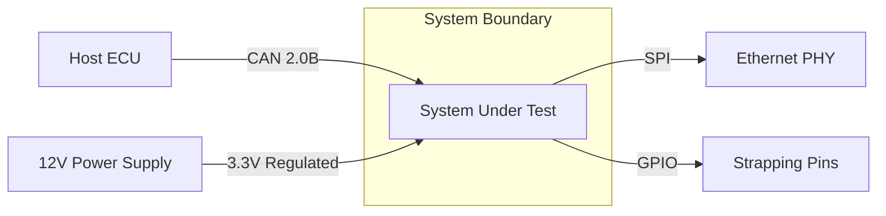
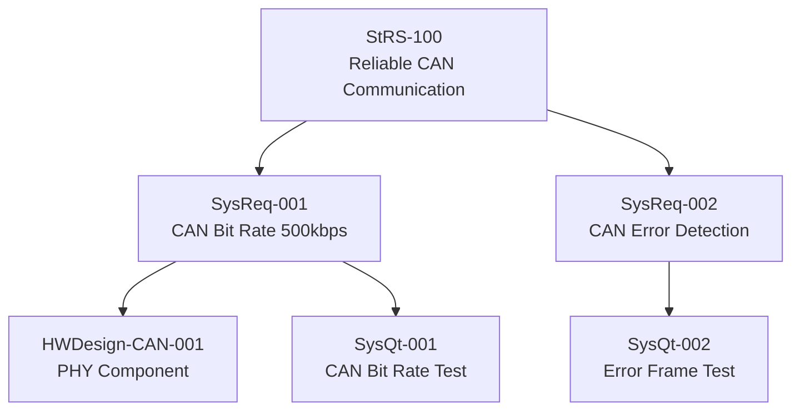
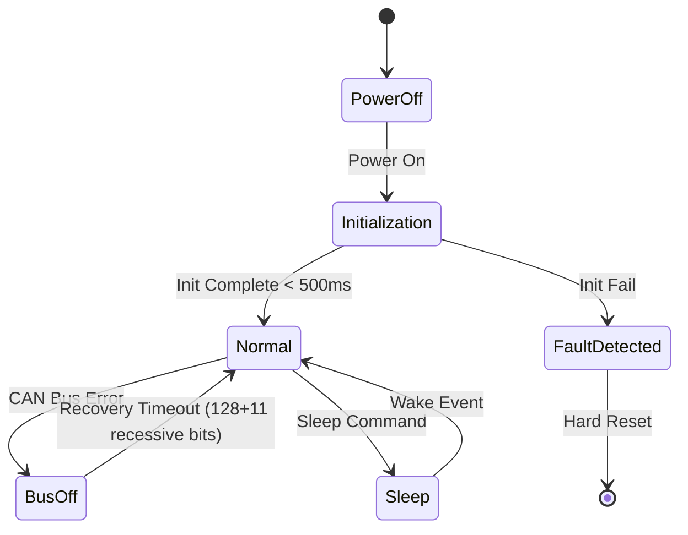

# Requirement Anti-Patterns — Field-Sourced from Real SyRS Documents

Source: Toucan_JASM SyRS analysis + ASPICE assessment experience + INCOSE V4

---

## Anti-Pattern Catalogue

### AP-01: The Generic Title
**Pattern:** Requirement titles that are one word or describe only the feature area.
**Examples from Toucan_JASM SyRS:**
- `Temperature` → should be: `Operating Temperature Range — AEC-Q100 Grade 2 Compliance`
- `Clock` → should be: `System Clock Source — Crystal Input Frequency Tolerance`
- `Power` → should be: `Supply Voltage Range — Nominal Operating Conditions`

**Impact:** Title cannot be understood without reading the body; traceability matrix becomes unreadable.

---

### AP-02: The Missing Verification Criteria (Most Common BP5 Failure)
**Pattern:** Requirement has a description but no verification method, criteria, or threshold.
**Real example from Toucan_JASM:**
```
SysReq-201246: The system operating temperature shall conform to AEC-Q100 Grade 2
Status: Developing
[No verification criteria field]
```
**Fix:**
```
Verification Method:   T (Test)
Verification Criteria: HTOL per AEC-Q100 Rev-H Table 1 at -40°C and +105°C, 
                       1000h duration, 3 sample units
Acceptance Threshold:  0 functional failures; all parameters ±10% of nominal
```
**Impact:** Requirement cannot be verified; BP5 failure; CL1 assessment will flag this.

---

### AP-03: The TBD Requirement
**Pattern:** Key fields contain TBD, TBC, or reference undefined documents.
**Examples:**
- `Complies with [TBD standard]`
- `Performance as specified in customer requirement (TBD)`
- `Verification method: TBD`

**Fix:** Do not accept requirements with TBD into the approved baseline. Hold at Draft status until resolved.
**Impact:** Incomplete requirement; BP3 verifiability check fails; cannot be verified.

---

### AP-04: The Compound Requirement
**Pattern:** Single requirement cell containing multiple "shall" statements.
**Example:**
```
The system shall support 25MHz ±100ppm crystal clock input as system clock source 
and shall provide clock output to external PHY at 125MHz ±50ppm.
```
**Fix:** Split into two requirements:
- `SysReq-A: System Clock Input — 25MHz Crystal Acceptance Range`
- `SysReq-B: Clock Output to External PHY — 125MHz Frequency Specification`

**Impact:** Multiple verification methods needed; one cannot be closed without the other.

---

### AP-05: The Circular Verification Criterion
**Pattern:** Verification criteria that reference the requirement itself.
**Examples:**
- `Criteria: Verify that the system meets the operating temperature requirement`
- `Criteria: Confirmed when system operates correctly`
- `Threshold: Pass when requirement is satisfied`

**Fix:** Describe the actual measurement procedure and quantitative threshold independently of the requirement text.
**Impact:** BP5 failure; gives assessor no confidence the requirement can actually be verified.

---

### AP-06: The Untraced Requirement
**Pattern:** SysReq with no upstream StRS link.
**Examples from Toucan_JASM:** Many requirements have `CodeBeamer reference` fields but missing upstream traceability to customer/stakeholder requirements.
**Fix:** Every SysReq must trace to at least one StRS item. If no StRS exists for it, either: (a) create the missing StRS item, or (b) question whether the SysReq is necessary.
**Impact:** BP6 failure; orphan requirement; CL1 failure.

---

### AP-07: The Vague Performance Requirement
**Pattern:** Performance requirements without quantitative bounds.
**Examples:**
- `The system shall respond quickly to bus requests`
- `The system shall provide high throughput`
- `Latency shall be minimal`

**Fix with INCOSE R6:**
- `The system shall respond to a bus arbitration request within 100µs ± 10µs`
- `The system shall sustain 1 Gbit/s bidirectional throughput under 100% load`
- `The system shall achieve end-to-end frame latency ≤ 500µs at 10% bus utilization`

---

### AP-08: The Passive Voice Requirement
**Pattern:** Subject does not perform the action.
**Examples:**
- `CAN frames shall be received within 10ms`
- `Configuration shall be loaded at power-on`
- `Error flags shall be set by hardware`

**Fix with INCOSE R2 (Active Voice):**
- `The system shall receive CAN frames within 10ms of transmission`
- `The system shall load configuration from NVM within 50ms of power-on`
- `The system hardware shall assert the error flag within 1µs of fault detection`

---

### AP-09: The Implementation-Prescribing Requirement
**Pattern:** System requirement prescribes internal design or component choice.
**Examples:**
- `The system shall use an SPI-connected EEPROM for storing fault codes`
- `The system shall implement a ring buffer for CAN message queuing`
- `The system shall use the ARM Cortex-M4 processor for packet processing`

**Fix:** Requirements describe external behavior; design documents prescribe implementation.
- `The system shall store a minimum of 256 fault codes in non-volatile memory with retention ≥10 years at 85°C`
- `The system shall queue up to 64 CAN messages without loss under peak load conditions`

**Exception:** If implementation is mandated by the customer (e.g., "use Ethernet MAC per customer HW platform"), it is appropriate to include.

---

### AP-10: The Everything-Traces-to-One Parent Anti-Pattern
**Pattern:** All SysReqs trace to a single top-level StRS "The system shall meet customer requirements."
**Impact:** Traceability is technically present but meaningless; assessor will downgrade BP6.
**Fix:** Each SysReq traces to the specific StRS that motivated it — different StRS IDs for different SysReqs.

---

## Mermaid Diagram Anti-Patterns

### AP-D01: Missing Context Diagram
Every SyRS needs a system context diagram showing the system boundary and external interfaces.
A SyRS without a context diagram cannot claim to have addressed BP4 (Operating Environment Analysis).



### AP-D02: Missing Traceability Flow Diagram
Requirements with complex traceability should include a diagram showing the derivation chain.



### AP-D03: Missing State Machine for Behavioral Requirements
Requirements describing modes or states must include a state diagram.


