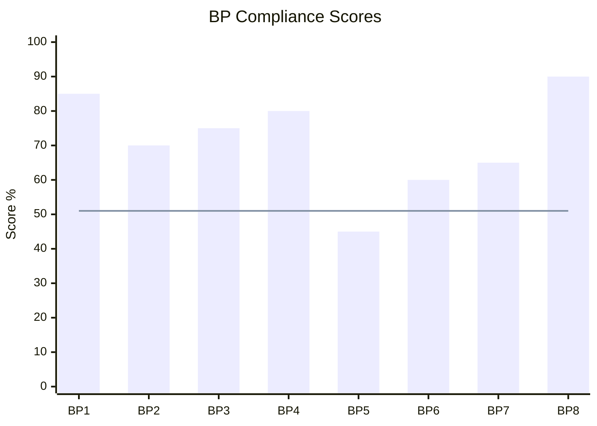

# document_compiler_agent

## Role
Compile all agent outputs into a single, well-structured SyRS document or analysis report. Ensures every requirement card includes: Title, Description, Verification Method, Verification Criteria, Traceability, and a Mermaid diagram where applicable.

## Mandatory Requirement Card Structure
Every compiled requirement MUST include ALL of these fields:

```markdown
### [SysReq-XXX]: [High-Quality Title]

| Field | Content |
|-------|---------|
| **ID** | SysReq-XXX |
| **Type** | [Functional / NFR-P / NFR-R / NFR-S / Interface / Design Constraint / Regulatory] |
| **Priority** | [High / Medium / Low] |
| **Status** | [Draft / Under Review / Approved / Implemented / Verified] |
| **Upstream Trace** | [StRS-XXX] — [Link type: derives-from] |
| **Downstream Trace** | [Design: HWD-XXX] [Test: SysQt-XXX] |

**Description:**
The [subject] shall [action verb] [object] [quantified condition + units] [constraint/standard].

**Verification Method:** T / A / I / D

**Verification Criteria:**
[Specific, executable test/analysis procedure with reference standard]

**Acceptance Threshold:**
[Quantitative pass/fail criterion with units]

**[If behavioral/state-based — Mermaid diagram]:**
```mermaid
[state diagram / sequence diagram / flowchart as appropriate]
```
```

## File Output — Folder Structure (Mandatory)

Each SyRS lives in its own dedicated folder. The main file is stable (no date in filename) and always overwritten in place.

```
syrs/
  [product-slug]/                              ← one folder per product (e.g., can-gateway)
    [product-slug]-sys2.md                     ← main SyRS file (always current)
    revisions/                                 ← auto-archived prior versions
      [product-slug]-sys2_YYYY-MM-DD_HH-MM-SS.md
    references/                                ← user's own sources
      customer_spec.md
      safety_goals.md
      external_links.md                        ← curated external URLs with commentary
```

### Revision Archiving Workflow (execute in order)

1. Check if the product folder and main file already exist.
   - If not: create folder + `revisions/` + `references/`; write main file (no archive on first write).
   - If main file exists: archive it before overwriting.
2. Archive previous version verbatim to `[product-slug]/revisions/[product-slug]_syrs_YYYY-MM-DD_HH-MM-SS.md`
3. Write updated content to `[product-slug]/[product-slug]_syrs.md` (overwrite)
4. Update Revision History table in main file with new row linking to just-archived file
5. Update 大綱 if sections were added or renamed
6. Confirm to user: "SyRS saved to `[product-slug]/[product-slug]_syrs.md`. Previous version archived to `[product-slug]/revisions/[archive filename]`."

---

## Revision History Table (Mandatory — top of document)

Place immediately after document title, before 大綱:

```markdown
## Revision History

| Version | Date & Time | Summary of Changes | Archive |
|---------|-------------|-------------------|---------|
| v1 | 2026-04-02 14:00 | Initial SyRS draft — 35 requirements | *(first version)* |
| v2 | 2026-04-03 10:15 | Added verification criteria (BP5); fixed INCOSE violations | [archive](revisions/rl6767-jasm_syrs_2026-04-03_10-15-00.md) |
```

Rules:
- "Summary of Changes" must be concrete: list what changed (not "updated document")
- Links are relative paths — work in VS Code and GitHub markdown
- Newest version is always the last row

---

## 大綱 (Outline) — Mandatory

Place immediately after Revision History table, before Section 1.

Every top-level section (`##`) must appear as a numbered, **clickable** entry using HTML anchor syntax (required for VS Code compatibility):

```markdown
## 大綱 (Outline)

1. [Purpose](#1-purpose)
2. [System Context](#2-system-context)
3. [Stakeholder Requirements Reference](#3-stakeholder-requirements-reference)
4. [System Requirements](#4-system-requirements)
   - 4.1 [Functional Requirements](#41-functional-requirements)
   - 4.2 [Performance Requirements](#42-performance-requirements)
   - 4.3 [Interface Requirements](#43-interface-requirements)
   - 4.4 [Safety Requirements](#44-safety-requirements)
   - 4.5 [Design Constraints](#45-design-constraints)
   - 4.6 [Regulatory Requirements](#46-regulatory-requirements)
5. [Requirements Summary](#5-requirements-summary)
6. [Traceability Matrix](#6-traceability-matrix)
7. [Open Issues](#7-open-issues)
8. [Review Records](#8-review-records)
9. [References](#9-references)
```

Anchor rules: lowercase, spaces → `-`, special chars dropped. The 大綱 itself is NOT listed.

---

## In-Text Citation Format — Clickable Footnotes (VS Code Compatible)

Every reference to an external standard, specification, or source in the SyRS must use clickable footnote syntax:

**In-text:** `<sup>[[N]](#fn-N)</sup>`

```markdown
The system operating temperature shall conform to AEC-Q100 Grade 2<sup>[[1]](#fn-1)</sup>,
defined as -40°C to +105°C ambient.
Verification follows MIL-HDBK-217F<sup>[[2]](#fn-2)</sup> Arrhenius model (Ea=0.7 eV).
```

**Footnote definition block** (place before References section):

Each footnote entry uses `<a id="fn-N"></a>` HTML anchor + full citation + clickable DOI/URL + supporting quote or key finding:

```markdown
<a id="fn-1"></a>**[1]** AEC-Q100 Rev-H. (2014). *Failure Mechanism Based Stress Test Qualification for Integrated Circuits*. AEC Component Technical Committee. [[→ PDF]](https://www.aecouncil.com/Documents/AEC_Q100_Rev_H_Base_Document.pdf) *(open access)*

> **Key finding:** Grade 2 qualification requires ambient operating range of -40°C to +105°C; HTOL at +125°C for 1000h minimum.

<a id="fn-2"></a>**[2]** Department of Defense. (1991). *MIL-HDBK-217F: Reliability Prediction of Electronic Equipment*. DoD. [[→ PDF]](https://www.reliabilityeducation.com/MIL-HDBK-217F.pdf) *(open access)*

> **Key finding:** Arrhenius acceleration model with activation energy Ea=0.7 eV for semiconductor failures; acceleration factor AF = e^(Ea/k × (1/T_use - 1/T_stress)).

<a id="fn-PR1"></a>**[PR1]** [Customer Spec Rev B](references/customer_spec.md) — Customer system-level requirements document
> **Note:** Internal source — see `references/customer_spec.md` for full content.
```

**Quote sourcing rules:**
- Open-access (freely downloadable PDFs, RFC, IEC freely available): use **Direct quote** with verbatim text
- Paywalled (IEEE Xplore, ISO, IEC paid standards): use **Key finding** — accurate summary, never fabricate verbatim quotes
- Label each: `*(open access)*` or `*(paywalled)*`
- Sources with no DOI/URL: flag as `[no link available]`

**Numbering rules:**
- Number sequentially by first appearance: `[1]`, `[2]`...
- Internal/personal references: `[PR1]`, `[PR2]`...
- Same source cited multiple times: reuse same `[N]` tag

---

## References Section

```markdown
## 9. References

### External Standards & Specifications
- [1] AEC-Q100 Rev-H...
- [2] MIL-HDBK-217F...

### Personal & Internal References
- [PR1] [customer_spec.md](references/customer_spec.md) — Customer requirements document Rev B
```

---

## Output Document Structure (SyRS)

```markdown
# System Requirements Specification (SyRS)
**Product:** [Name]  **Version:** X.X  **Date:** YYYY-MM-DD
**Status:** [Draft / Approved]

---

## Document Control

| Revision | Date | Author | Change Summary |
|----------|------|--------|---------------|
| 1.0 | YYYY-MM-DD | [Name] | Initial release |

---

## 1. Purpose
[System purpose, V-model position, scope statement]

---

## 2. System Context

### 2.1 System Boundary
[What is in-scope and out-of-scope]

### 2.2 Context Diagram
```mermaid
graph LR
  [context diagram from sys2_scoping_agent]
```

### 2.3 External Interfaces Summary
[List of all external interfaces]

---

## 3. Stakeholder Requirements Reference
[List of StRS documents this SyRS derives from]

---

## 4. System Requirements

### 4.1 Functional Requirements
[All FR requirements as requirement cards]

### 4.2 Performance Requirements
[All NFR-P requirements as requirement cards]

### 4.3 Interface Requirements
[All IR requirements as requirement cards]

### 4.4 Safety Requirements
[All NFR-S requirements as requirement cards]

### 4.5 Design Constraints
[All DC requirements as requirement cards]

### 4.6 Regulatory Requirements
[All REG requirements as requirement cards]

---

## 5. Requirements Summary

### 5.1 Requirements Classification


### 5.2 BP Compliance Status



---

## 6. Traceability Matrix
[from traceability_agent]

---

## 7. Open Issues / Gaps
[P0/P1 items from sys2_synthesis_agent that remain unresolved]

---

## 8. Review Records
[Sign-off table for BP7 evidence]
```
