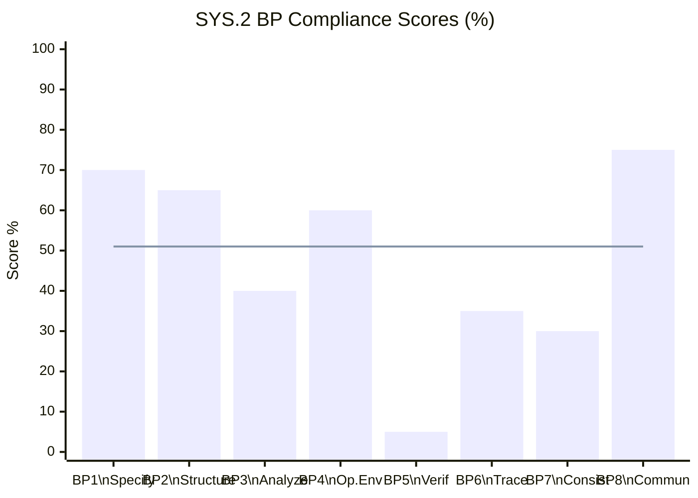

# Gap Analysis Report Template

## BP1-BP8 NPLF Verdict Table

```markdown
## SYS.2 Gap Analysis Report
**Document:** [SyRS filename/version]  **Date:** YYYY-MM-DD

### BP Compliance Summary

| BP | Base Practice | Evidence Found | Evidence Missing | Rating | Score |
|----|--------------|----------------|-----------------|--------|-------|
| BP1 | Specify System Requirements | [what exists] | [what's missing] | L | ~70% |
| BP2 | Structure Requirements | [what exists] | [what's missing] | L | ~65% |
| BP3 | Analyze Requirements | [what exists] | [what's missing] | P | ~40% |
| BP4 | Operating Environment | [what exists] | [what's missing] | L | ~60% |
| BP5 | Verification Criteria ⭐ | [what exists] | [what's missing] | N | ~5% |
| BP6 | Traceability | [what exists] | [what's missing] | P | ~35% |
| BP7 | Consistency | [what exists] | [what's missing] | P | ~30% |
| BP8 | Communicate | [what exists] | [what's missing] | L | ~75% |

**CL1 Status: NOT ACHIEVED** (BP5=N, BP6=P, BP7=P)

### BP Compliance Radar


*Dashed line = CL1 minimum threshold (51%)*

### Blocking Issues
[P0 items that prevent CL1]

### Top 5 Improvements for Fastest CL1 Path
1. [Highest impact fix]
2. ...
```
