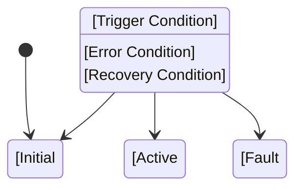
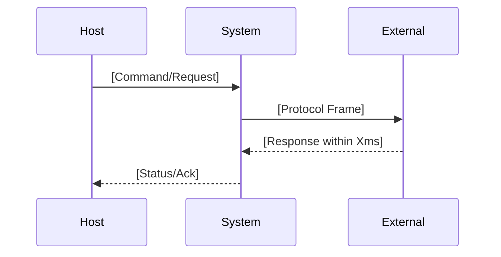
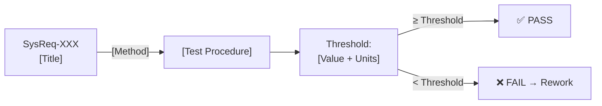
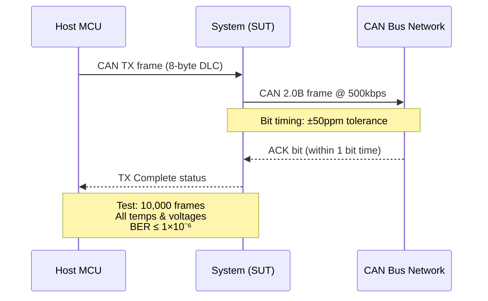

# Requirement Card Template

## MANDATORY FIELDS — All fields required before baselined

```markdown
### [SysReq-XXX]: [Title: Feature/System — Property — Constraint, max 80 chars]

| Field | Content |
|-------|---------|
| **ID** | SysReq-XXX |
| **Version** | 1.0 |
| **Type** | [Functional / NFR-Performance / NFR-Reliability / NFR-Safety / Interface / Design Constraint / Regulatory] |
| **Priority** | [High / Medium / Low] |
| **Status** | [Draft / Under Review / Approved / Implemented / Verified] |
| **Upstream Trace** | [StRS-XXX] `derives-from` |
| **Downstream Trace** | Design: [HWD/SWArch ID] · Test: [SysQt-XXX] |
| **Review Date** | YYYY-MM-DD |
| **Reviewer** | [Name] |

---

#### Description

The [system/component] shall [active verb] [object] [quantified condition] [unit] [constraint/standard reference].

> **IEEE 29148 Checklist:**
> - [ ] Unambiguous: no forbidden vague terms
> - [ ] Complete: no TBD/TBC
> - [ ] Singular: one "shall"
> - [ ] Verifiable: can write T/A/I/D test
> - [ ] Conforming: active voice, units on all numbers

---

#### Verification

| Field | Content |
|-------|---------|
| **Verification Method** | **T** / A / I / D |
| **Verification Criteria** | [Specific executable procedure. Reference: standard/clause if applicable] |
| **Acceptance Threshold** | [Quantitative value + units + condition] — Source: [citation]<sup>[[N]](#fn-N)</sup> |
| **Test Environment** | [Equipment, temperature, voltage, signal conditions] |

> **Threshold Source Rule (MANDATORY):** Every numeric value in the Acceptance Threshold MUST have a clickable citation<sup>[[N]](#fn-N)</sup> to its source — one of:
> - **Customer requirement**: `<sup>[[PR3]](#fn-PR3)</sup>` → Leapmotor meeting transcript, customer spec
> - **Standard mandate**: `<sup>[[1]](#fn-1)</sup>` → ISO, AEC-Q100, CISPR, IEEE standard + clause
> - **Engineering analysis**: `<sup>[[PR-R]](#fn-PR-R)</sup>` → Research document, simulation, calculation with methodology cited
> - **Design target**: Must be explicitly labeled "Design target — to be confirmed during HW characterization"
>
> A bare number without a citation is **not acceptable** — the assessor will ask "where does this number come from?" and the requirement will fail the Correct characteristic (IEEE 29148 §5.2.8).

---

#### Diagram

*[Include a Mermaid diagram if the requirement is behavioral (state machine), interface (sequence diagram), functional flow (flowchart), or involves complex conditions. Skip only for simple threshold requirements with no behavioral complexity.]*

**[Select diagram type based on requirement nature:]**

**For behavioral/state requirements:**


**For interface/communication requirements:**


**For functional flow requirements:**
```mermaid
flowchart LR
  Input["[Input Condition]"] --> Process["[System Processing]"]
  Process --> Condition{[Decision]}
  Condition -->|"Normal"| Output["[Expected Output]"]
  Condition -->|"Error"| Fault["[Error Handling]"]
```

**For verification flow:**


---

#### Rationale *(optional but recommended)*
[Why this requirement exists; which stakeholder need it satisfies; any design decisions it constrains]

---

#### Change History

| Version | Date | Author | Change |
|---------|------|--------|--------|
| 1.0 | YYYY-MM-DD | [Name] | Initial |
```

---

## Example — Completed Requirement Card

```markdown
### SysReq-001: CAN Bus Interface — Maximum Bit Rate and Tolerance

| Field | Content |
|-------|---------|
| **ID** | SysReq-001 |
| **Version** | 1.2 |
| **Type** | Interface |
| **Priority** | High |
| **Status** | Approved |
| **Upstream Trace** | StRS-100 `derives-from` |
| **Downstream Trace** | Design: HWD-CAN-001 · Test: SysQt-001, SysQt-002 |
| **Review Date** | 2026-04-01 |
| **Reviewer** | J. Chen |

#### Description

The system shall support CAN 2.0B communication at a nominal bit rate of 500 kbps ± 50 ppm under all specified supply voltage (3.0V–3.6V) and temperature (-40°C to +105°C) conditions.

> **IEEE 29148 Checklist:** ✅ All 9 characteristics pass

#### Verification

| Field | Content |
|-------|---------|
| **Verification Method** | **T** (Test) |
| **Verification Criteria** | Apply Vector CANalyzer to CAN H/L pins; measure bit rate over 10,000 consecutive frames; test at Vcc=3.0V, 3.3V, 3.6V; test at -40°C, +25°C, +105°C (9 conditions total) |
| **Acceptance Threshold** | Bit rate = 500,000 bps ± 25 bps (50 ppm); BER ≤ 1×10⁻⁶; 0 error frames per 10,000-frame run |
| **Test Environment** | CAN analyzer (Vector CANalyzer or equiv.); regulated supply; temperature chamber |

#### Diagram


```
