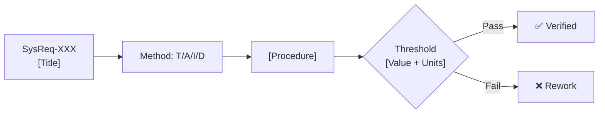

# Verification Criteria Card Template (BP5)

## Per-Requirement Card

```markdown
### Verification Criteria: SysReq-XXX

| Field | Content |
|-------|---------|
| **Requirement** | SysReq-XXX: [Title] |
| **Requirement Description** | [Full shall statement] |
| **Verification Method** | **T** (Test) / A (Analysis) / I (Inspection) / D (Demo) |
| **Verification Criteria** | [Specific executable procedure] |
| **Acceptance Threshold** | [Quantitative pass/fail: value + units + condition] |
| **Test Environment** | [Equipment, conditions, setup] |
| **Reference Standard** | [Standard name + clause, or "N/A"] |
| **BP5 Status** | ✅ Complete / ⚠️ Partial / ❌ Blocked |

**Verification Flow:**

```

## BP5 Coverage Summary

```markdown
### BP5 Coverage Report

| Metric | Count | % |
|--------|-------|---|
| Total requirements | N | 100% |
| Method specified | N | X% |
| Criteria described | N | X% |
| Threshold quantified | N | X% |
| **Fully complete** | **N** | **X%** |
| Blocked (cannot verify as written) | N | X% |

**BP5 Rating:** [N/P/L/F] (~X%)
```
