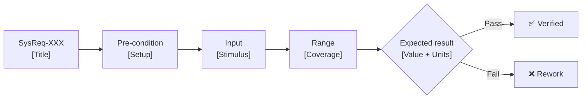

# Verification Criteria Card Template (BP5)

Source format: gateway_present_20260402_ASPICE.md Slide 12 — "Develop Verification Criteria"

## Per-Requirement Card

```markdown
### Verification Criteria: SysReq-XXX

| Field | Content |
|-------|---------|
| **Requirement** | SysReq-XXX: [Title] |
| **Requirement Description** | [Full shall statement] |
| **Early Idea (Method)** | [T=Test / A=Analysis / I=Inspection / D=Demo — describe testing concept] |
| **Pre-condition** | [What must be set up/enabled/configured before the test can run] |
| **Input** | [What is sent, applied, or triggered to stimulate the system] |
| **Range** | [Coverage: valid values + boundary/edge cases + negative/invalid cases] |
| **Expected result** | [Measurable outcome — value + units + pass condition] — Source: [[N]](#fn-N) |
| **BP5 Status** | ✅ Complete / ⚠️ Partial / ❌ Blocked |

**Verification Flow:**


<a id="fn-N"></a>[N] [Source citation — customer spec / standard clause / engineering analysis]
```

---

## Example (from internal training)

**Requirement:** If the IP routing is ready to transmit the packet, the switch shall replace destination MAC address according to the configured EGRIF entry.

```markdown
| Field | Content |
|-------|---------|
| **Early Idea (Method)** | T (Test) — Inject a test packet at the Ingress port and capture it at the Egress port using a network packet analyzer. |
| **Pre-condition** | IP routing is enabled; an EGRIF entry is strictly configured with a specific Unicast DMAC, SMAC, and VLAN ID. |
| **Input** | Send an IP packet with a destination IP that matches the routing rule mapped to the configured EGRIF. |
| **Range** | Valid: Unicast MACs / VLANs (1–4094). Negative: Multicast/Broadcast MACs, missing EGRIF entry. |
| **Expected result** | Captured Egress packet's DMAC, SMAC, and VLAN ID must be exactly replaced according to the EGRIF configuration. |
```

---

## BP5 Coverage Summary

```markdown
### BP5 Coverage Report

| Metric | Count | % |
|--------|-------|---|
| Total requirements | N | 100% |
| Early Idea (Method) specified | N | X% |
| Pre-condition defined | N | X% |
| Input defined | N | X% |
| Range includes negative tests | N | X% |
| Expected result quantified | N | X% |
| **Fully complete (all 5 fields)** | **N** | **X%** |
| Blocked (cannot verify as written) | N | X% |

**BP5 Rating:** [N/P/L/F] (~X%)
```

---

## 5-Field VC Quality Checklist

| Field | BLOCK condition | WARN condition |
|-------|----------------|----------------|
| Early Idea (Method) | Blank or "TBD" | Method stated but no concept described |
| Pre-condition | Blank without justification | Only "device powered on" — too vague |
| Input | Blank or "as required" | No specific stimulus value |
| Range | No negative tests | Only happy path; no edge cases |
| Expected result | Not quantitative / circular / no source | Range estimate without standard reference |
